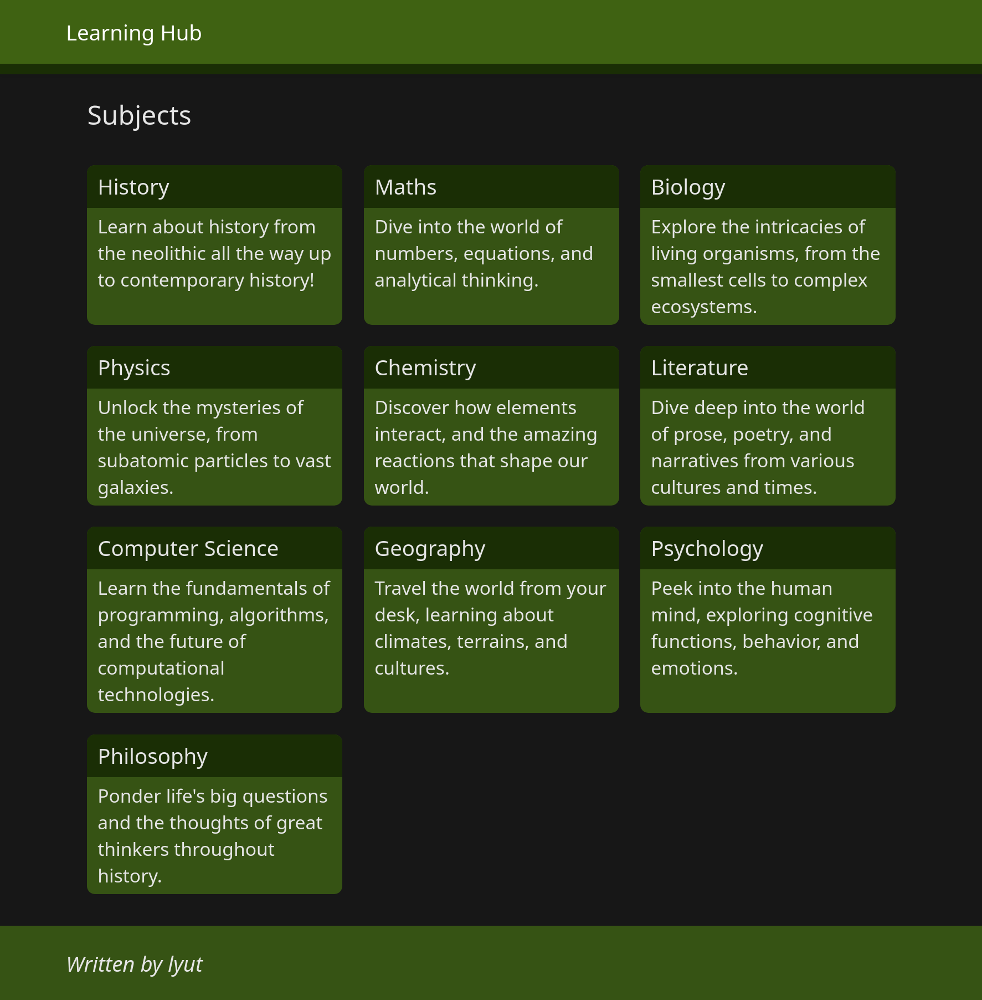

# Learning Hub

This is an app for a learning hub. The idea is that there are subjects, each with it's own syllabus broken down in to topics and subtopics. Each subtopic will have learning resources associated with it such as books (epub, pdf etc.), videos, papers and articles.

The data is currently stored in /src/lib/data. There is no easy way to add in data at the moment, maybe in the future we'll add that ability via. the app, or via. some sort of command-line tool, but for now, you'll have to manually add the data.

Associated resources must be uploaded and managed by the user, as to avoid any copyright issues.

## Screenshot



## Developing

To set up your development environment, follow the below instructions.

1. Install dependencies

```bash
npm install
#pnpm install
#yarn
```

2. Start the development server

```bash
npm run dev
#pnpm run dev
#yarn dev

# or start the server and open the app in a new browser tab
npm run dev -- --open
#pnpm run dev -- --open
#yarn dev -- --open
```

## Building

To create a production version of your app:

```bash
npm run build
#pnpm run build
#yarn build
```

You can preview the production build with `npm run preview` (or equivalent for your package manager).

> To deploy your app, you may need to install an [adapter](https://kit.svelte.dev/docs/adapters) for your target environment.
